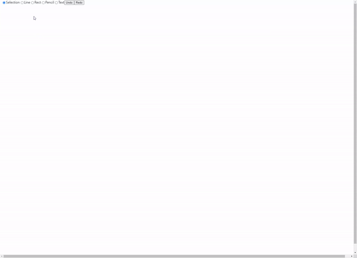
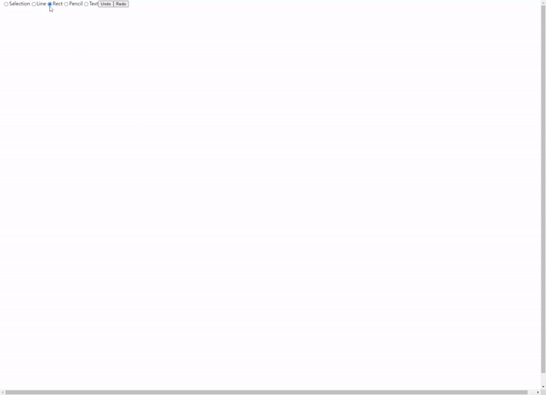
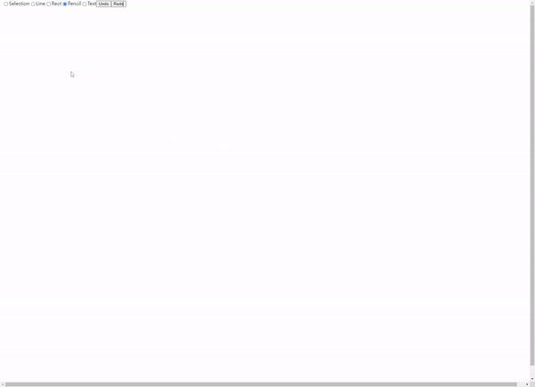
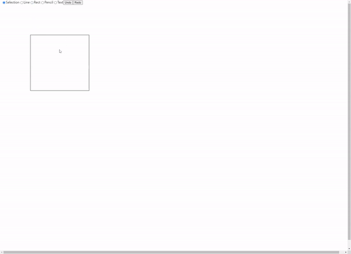
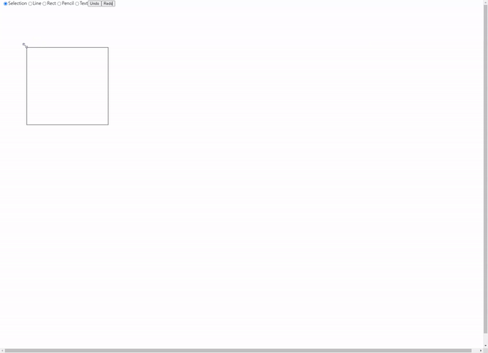
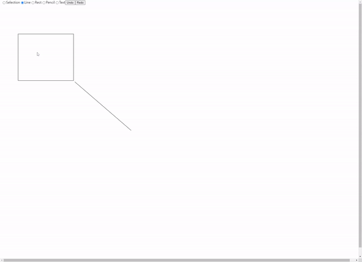
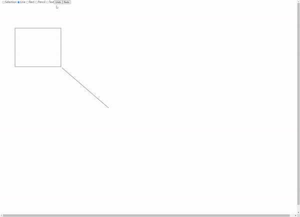

# 그림판 만들기

### [페이지 바로가기](https://yongjin-jo.github.io/drawing_app/)

#### 개발 상황

- 1차 개발 완료
  

### 라이브러리

- lodash: 4.17.21
- React: 18.0.0

### 개발 동기

평소에 웹 그립판을 사용한 적 있지만 동작원리를 알아볼 생각이 없었다.
웹 그림판을 사용하다, 웹 그림판의 기본적인 동작 방식이 어떻게 되는지 궁금하여 제작하게 되었다.

기본적인 동작 방식을 알고 싶었기에 기본적인 canvas web API로만 용하여 만들게 되었디.

## 주요 기능

### Line

- 직선 엘리멘트를 생성합니다.

### Rectangle

- 사각형 엘리멘트를 생성합니다.

### Pencil

- 지유롭게 선을 그을 수 있는 기능 입니다.

### Selection

- 생성된 엘리멘트를 선택할 수 있는 기능 입니다.

#### moving

- 선택된 Elements를 움직일수 있게 하는 기능 입니다.

#### reSizing

- 선택된 엘리멘트의 사이즈를 조정할 수 있는 기능 입니다.

### Undo

- Elements을 생성하기 전 상태로 돌릴수 있습니다.

### Rode

- Undo를 사용하기 전 상태로 돌릴수 있습니다.

## 다음 개발 계획

- [x] 코드 리펙토링
- [ ] 상태관리 라이브러리 추가
- [ ] 태그 컴포넌트 화
- [ ] Selection 기능 Selection Box UI 추가
- [ ] 도형 세부 옵션
- [ ] 다른 도형 추가
- [ ] UI/UX 개선
